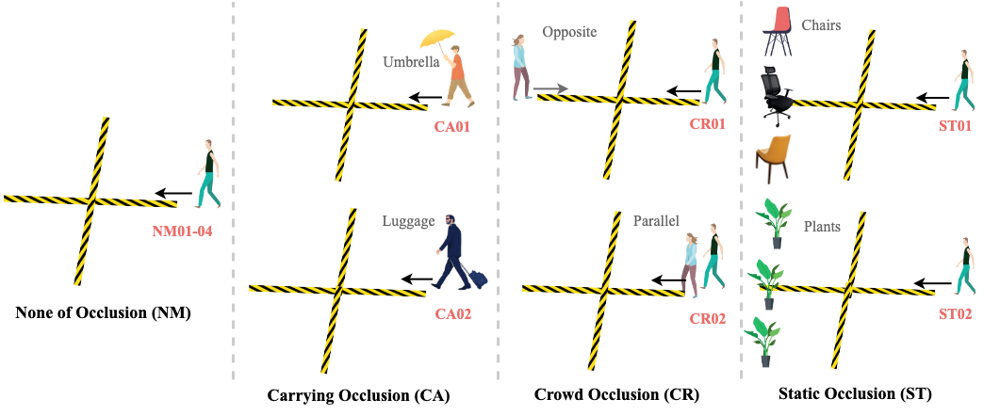

This is an official repository for "Occluded Gait Recognition with Mixture of Experts: An Action Detection Perspective" (ECCV2024), providing a pioneering Occluded Gait database (OccGait, Prepared already) and the code of GaitMoE (Remained to be completed).

## Highlights in OccGait

(1) It provides 101 identities with 8 camera views and over 80K sequences.

(2) Each identity walks under 4 different types of occluded scenarios, providing access to analyze the impact of occlusion in practical applications.

(3) Due to the privacy issue, OccGait currently only provides the **silhouette** version. Other data types, e.g., **pose**, remain to be considered. It is essential to note that it is **ACADEMIC USE ONLY**. 

## Introduction of OccGait
The OccGait is collected in an indoor gait recognition laboratory. There are 3 cameras (Cam1 of 0◦, Cam2 of 45◦, Cam3 of 315◦) with 1920 × 1080 resolution in a square area (8m x 8m). During the data collection process, the subjects follow a walking routine 1-2-3-4 as shown below. Overlapping camera views caused by the combination of 3 cameras and 4 walking directions are filtered out, and therefore gait sequences with 8 camera views are obtained. Four types of occluded scenarios are considered: None of Occlusion (Normal Walking as NM), Carrying Occlusion (CA), Crowd Occlusion (CR), and Static Occlusion (ST).

#### 1. The Diagram of Data Collection Process


#### 2. The Diagram of 4 Types of Occlusion Scenarios


#### 3. Examples of OccGait (RGB, Instance Segmentation with Mask2Former, and Silhouette)


## Download OccGait
To obtain the OccGait dataset, all users are required to complete the following steps:
  1. Download and sign the latest agreement within this repository.
  2. Use the organization's email and send a request with a signed agreement attached to BNU-IVC@outlook.com.
  
We will handle your requests within a week (**Occasionally, emails may be flagged as spam. If you haven't received a response within a week, please resend your mail from an alternate email address.**). In case you encounter any issues, please feel free to reach out to us via BNU-IVC@outlook.com. <br>

## GaitMoE
Remained to be completed.

## Citation
Please cite the following paper if you find this useful in your research:

```BibTeX
@InProceedings{Huang_2024_ECCV,
    author    = "Panjian, Huang and Yunjie, Peng and Saihui, Hou and Chunshui, Cao and Xu, Liu and Zhiqiang, He and Yongzhen, Huang",
    title     = "Occluded Gait Recognition with Mixture of Experts: An Action Detection Perspective",
    booktitle = "Computer Vision -- ECCV 2024",
    year      = "2024"
}
```

**Note:**
This dataset is only used for **ACADEMIC PURPOSES**, anyone can not use this dataset for anything that might be considered commercial use.
